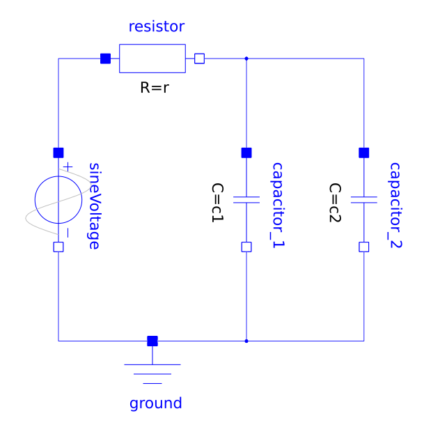

:stem: latexmath

[indices]
==== Indices

There are multiple, sometimes closely related, definitions of indices for DAE systems.
Usually these indices are a measure of how far from an ODE the DAE is.

[differential-index]
===== Differential Index

The minimum number of times a DAE

[latexmath]
++++
F(\dot{x}(t), x(t), t) = 0
++++

has to be differentiated with respect to time latexmath:[t] to be able to determine latexmath:[\dot{x}(t)] as a function of latexmath:[t] and latexmath:[x] is called the _differential index_.

See <<hairer2006numerical,[hairer2006numerical]>>.

[perturbation-index]
===== Perturbation Index

The _perturbation index_ measures the sensitivity of the solution of a DAE to perturbations of its right-hand side.
The DAE

[latexmath]
++++
F(\dot{x}(t), x(t), t) = 0
++++

has perturbation index latexmath:[p] along a solution latexmath:[x(t)] if latexmath:[p] is the smallest non-negative integer such that the solution latexmath:[\tilde{x}(t)] of the perturbed system

[latexmath]
++++
F(\dot{\tilde{x}}(t), \tilde{x}(t), t) = \delta(t)
++++

satisfies

[latexmath]
++++
\|x(t) - \tilde{x}(t)\| \leq C \left( \|x(t_0) - \tilde{x}(t_0) \| + \max_{t_0 \le \xi \le t}\|\delta(\xi)\| + \max_{t_0 \le \xi \le t}\|\dot{\delta}(\xi)\| + \cdots + \max_{t_0 \le \xi \le t}\|\delta^{(p-1)}(\xi)\| \right)
++++

for some constant latexmath:[C] and a sufficiently small and smooth perturbation latexmath:[\delta(t)].
A DAE with perturbation index greater than 1 is called a _higher-index DAE_.

See <<hairer2006numerical,[hairer2006numerical]>>.

[example-structural-singularity]
====== Example of Structural Singularity

<<cellier2006continuous,[cellier2006continuous, chapter 7.7 Structural Singularity Elimination]>> provides a simple electric circuit model that is a higher-index DAE.

[[ParallelCapacitor]]
.Modelica model of an electric circuit with two capacitors in parallel.

The circuit has two capacitors in parallel and can be represented with equations:

[latexmath]
++++
\begin{split}
v_0 &= f(t) \\
v_R &= R \cdot i_0 \\
i_1 &= C_1 \cdot \dot{v_1} \\
i_2 &= C_2 \cdot \dot{v_2} \\
v_0 &= v_R + v_1 \\
v_2 &= v_1 \\
i_0 &= i_1 + i_2
\end{split}
++++

When both capacitive voltages latexmath:[v_1] and latexmath:[v_2] are chosen as state variables, equation latexmath:[v_2 = v_1] has no unknowns left, so it is a _constraint equation_.

There are different ways to solve this.
The modeler could change the causality or exporting tools can try to reduce the perturbation index symbolically footnote:[e.g. by using Pantelides algorithm, see <<cellier1993automated>>] to end up with a consistent initialization for the system.
